# 基于深度视觉模型的智能文档扫描识别软件设计说明书

软件名称：基于深度视觉模型的智能文档扫描识别软件
软件简称：智能文档扫描识别软件
版本号：V1.0

## 目录

- 1 引言
- 1.1 编写目的
- 1.2 项目背景与范围
- 1.3 术语与参考
- 2 需求概要分析
- 2.1 需求背景
- 2.2 建设目标
- 2.3 核心业务需求
- 2.4 数据与接口需求
- 2.5 运行、安全与验收概要
- 3 系统概述
- 3.1 系统边界与运行关系
- 3.2 功能模块
- 3.3 技术范围和外部依赖
- 4 总体设计
- 4.1 设计原则
- 4.2 组件协作
- 4.3 运行部署总体结构
- 4.4 接口和数据边界
- 5 详细设计
- 5.1 Android客户端与设置管理
- 5.2 文件选择、上传与存储
- 5.3 OCR任务创建与状态轮询
- 5.4 PostgreSQL队列领取与重试
- 5.5 OCR后端选择与推理执行
- 5.6 结果持久化与双格式展示
- 5.7 数据对象与状态管理
- 5.8 接口边界与运行部署
- 6 数据设计
- 7 接口设计
- 8 运行与部署设计
- 9 安全与权限设计
- 10 测试与验证
- 11 结论

## 1 引言

本文档说明软件需求边界、架构、模块、数据、接口、部署、安全和测试，为登记、部署与维护提供依据。

### 1.1 编写目的

本节内容在PDF正稿中按已核验代码、配置和运行事实详细展开。

### 1.2 项目背景与范围

本节内容在PDF正稿中按已核验代码、配置和运行事实详细展开。

### 1.3 术语与参考

本节内容在PDF正稿中按已核验代码、配置和运行事实详细展开。

## 2 需求概要分析

需求概要分析待作者确认。软件面向需要把图片或PDF转换为Markdown和纯文本的文档处理用户。

### 2.1 需求背景

本节内容在PDF正稿中按已核验代码、配置和运行事实详细展开。

### 2.2 建设目标

本节内容在PDF正稿中按已核验代码、配置和运行事实详细展开。

### 2.3 核心业务需求

本节内容在PDF正稿中按已核验代码、配置和运行事实详细展开。

### 2.4 数据与接口需求

本节内容在PDF正稿中按已核验代码、配置和运行事实详细展开。

### 2.5 运行、安全与验收概要

本节内容在PDF正稿中按已核验代码、配置和运行事实详细展开。

## 3 系统概述

系统由Android客户端、FastAPI、PostgreSQL、本地文件目录、工作进程和可配置识别后端组成。

### 3.1 系统边界与运行关系

本节内容在PDF正稿中按已核验代码、配置和运行事实详细展开。

### 3.2 功能模块

本节内容在PDF正稿中按已核验代码、配置和运行事实详细展开。

### 3.3 技术范围和外部依赖

本节内容在PDF正稿中按已核验代码、配置和运行事实详细展开。

## 4 总体设计

系统采用移动表现、接口服务、任务业务、数据队列和识别执行分层，并以公开和内部接口隔离调用边界。

### 4.1 设计原则

本节内容在PDF正稿中按已核验代码、配置和运行事实详细展开。

### 4.2 组件协作

本节内容在PDF正稿中按已核验代码、配置和运行事实详细展开。

### 4.3 运行部署总体结构

本节内容在PDF正稿中按已核验代码、配置和运行事实详细展开。

### 4.4 接口和数据边界

本节内容在PDF正稿中按已核验代码、配置和运行事实详细展开。

## 5 详细设计

每个详细设计小节均包含职责、输入、输出、处理流程、异常处理和至少两类对应设计图。

### 5.1 Android客户端与设置管理

本节内容在PDF正稿中按已核验代码、配置和运行事实详细展开。

### 5.2 文件选择、上传与存储

本节内容在PDF正稿中按已核验代码、配置和运行事实详细展开。

### 5.3 OCR任务创建与状态轮询

本节内容在PDF正稿中按已核验代码、配置和运行事实详细展开。

### 5.4 PostgreSQL队列领取与重试

本节内容在PDF正稿中按已核验代码、配置和运行事实详细展开。

### 5.5 OCR后端选择与推理执行

本节内容在PDF正稿中按已核验代码、配置和运行事实详细展开。

### 5.6 结果持久化与双格式展示

本节内容在PDF正稿中按已核验代码、配置和运行事实详细展开。

### 5.7 数据对象与状态管理

本节内容在PDF正稿中按已核验代码、配置和运行事实详细展开。

### 5.8 接口边界与运行部署

本节内容在PDF正稿中按已核验代码、配置和运行事实详细展开。

## 6 数据设计

核心数据为ocr_files、ocr_tasks和ocr_results，任务状态、索引、外键和唯一约束来自真实模型与SQL。

## 7 接口设计

本文档中只列出关键业务接口。每项接口覆盖用途、调用方、参数、返回和脱敏示例。

## 8 运行与部署设计

部署覆盖环境准备、硬件条件、启动步骤、关键脚本、端口、防火墙和启动检查。

## 9 安全与权限设计

安全设计区分身份入口、角色与数据访问、脱敏日志与异常处理，并标记当前未实现的认证控制。

## 10 测试与验证

测试覆盖UI、功能、接口、安全异常和部署验证，并区分已通过、按条件跳过和待专项确认。

## 11 结论

软件已形成移动端到异步识别结果展示的完整工程闭环，生产安全和模型精度仍待作者确认。

## 设计图索引

```text
详细设计小节 - 设计图文件 - 图示说明TXT - 图示类型 - 覆盖内容
5.1 Android客户端与设置管理 - 04_component_collaboration.png - 04_component_collaboration.txt - 组件图 - 移动端与服务端组件职责
5.1 Android客户端与设置管理 - 06_settings_sequence.png - 06_settings_sequence.txt - 时序图 - 地址读取和保存顺序
5.2 文件选择、上传与存储 - 07_file_upload_sequence.png - 07_file_upload_sequence.txt - 时序图 - 文件选择、分块上传和文件记录
5.2 文件选择、上传与存储 - 17_storage_activity.png - 17_storage_activity.txt - 活动图 - 流式保存与摘要计算
5.3 OCR任务创建与状态轮询 - 08_task_poll_sequence.png - 08_task_poll_sequence.txt - 时序图 - 创建、轮询和结果读取
5.3 OCR任务创建与状态轮询 - 22_ui_state_model.png - 22_ui_state_model.txt - 状态图 - Android页面状态转换
5.4 PostgreSQL队列领取与重试 - 09_queue_claim_sequence.png - 09_queue_claim_sequence.txt - 时序图 - 事务行锁领取
5.4 PostgreSQL队列领取与重试 - 18_retry_activity.png - 18_retry_activity.txt - 活动图 - 失败重试决策
5.5 OCR后端选择与推理执行 - 10_inference_sequence.png - 10_inference_sequence.txt - 时序图 - 后端选择和子进程推理
5.5 OCR后端选择与推理执行 - 24_error_paths.png - 24_error_paths.txt - 活动图 - 推理与接口异常恢复
5.6 结果持久化与双格式展示 - 11_result_sequence.png - 11_result_sequence.txt - 时序图 - 结果写入和双格式读取
5.6 结果持久化与双格式展示 - 05_mobile_interaction_flow.png - 05_mobile_interaction_flow.txt - 交互流程图 - 用户完整操作路径
5.7 数据对象与状态管理 - 14_er_model.png - 14_er_model.txt - ER图 - 表、字段、基数和约束
5.7 数据对象与状态管理 - 15_domain_class.png - 15_domain_class.txt - 类图 - 领域对象和状态枚举
5.7 数据对象与状态管理 - 13_task_state.png - 13_task_state.txt - 状态图 - 服务端任务状态转换
5.8 接口边界与运行部署 - 16_api_boundary.png - 16_api_boundary.txt - 接口边界图 - 公开与内部接口调用方
5.8 接口边界与运行部署 - 03_deployment_topology.png - 03_deployment_topology.txt - 部署图 - 终端、服务、数据库和资源
5.8 接口边界与运行部署 - 19_security_boundary.png - 19_security_boundary.txt - 安全边界图 - 已实现控制和待确认控制
10 测试与验证 - 20_test_strategy.png - 20_test_strategy.txt - 测试分层图 - 已验证与待专项验证
10 测试与验证 - 21_e2e_test_sequence.png - 21_e2e_test_sequence.txt - 测试时序图 - 端到端验证步骤与证据
```

### 01_overall_use_case

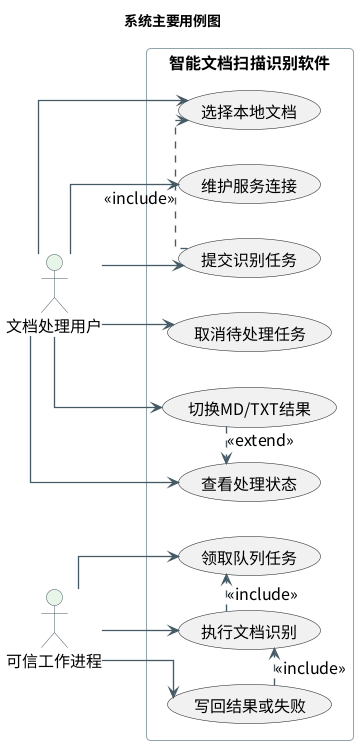

该用例图从业务参与者角度归纳软件主要能力。文档处理用户负责维护服务连接、选择本地文档、提交识别任务、查看状态、切换双格式结果和取消任务；可信工作进程负责领取队列任务、调用识别后端并写回完成或失败结果。包含与扩展关系体现选择文件是提交任务的前置步骤，结果查看依赖任务状态，工作进程写回依赖实际执行。图中没有虚构登录角色或管理后台。

### 02_system_architecture

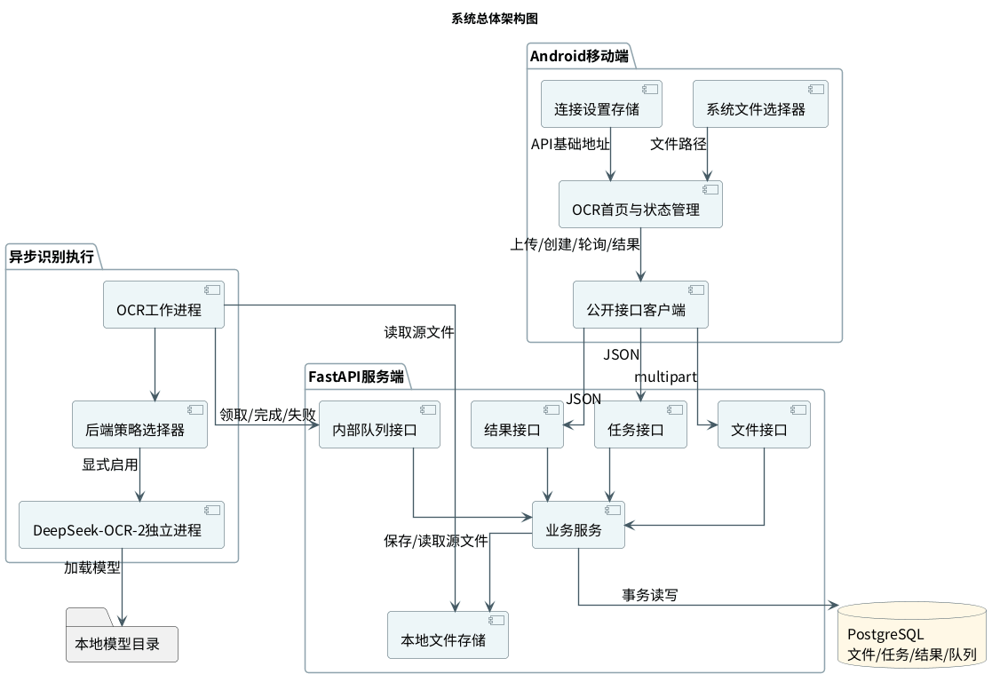

该系统架构图展示Android移动端、FastAPI服务端、异步识别执行层、PostgreSQL和本地资源之间的真实关系。移动端通过公开接口完成上传、任务与结果交互；服务端统一执行校验、业务规则、数据库事务和本地文件保存；工作进程通过内部队列接口领取任务，再由后端策略调用独立模型进程。图中明确区分源文件目录与模型目录，说明业务数据、任务状态和识别结果的主要流向。

### 03_deployment_topology

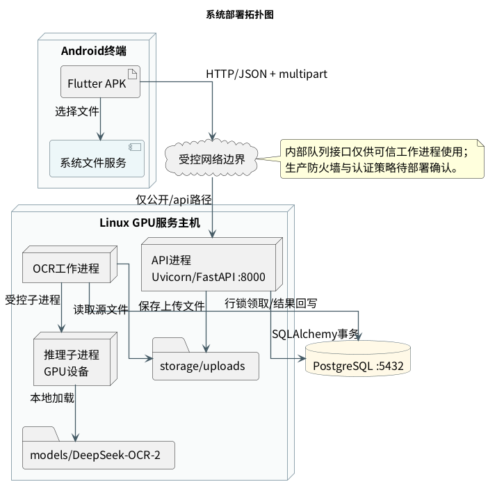

该部署图说明Android终端、受控网络边界、Linux GPU服务主机和PostgreSQL之间的部署关系。API进程默认提供8000端口，数据库默认使用5432端口；工作进程和推理子进程与API分离运行，并共享源文件目录和本地模型目录。公开接口由移动端访问，内部队列路径仅供可信工作进程使用。仓库没有完整认证与防火墙实现，因此图中将生产入口控制明确标记为待部署确认。

### 04_component_collaboration

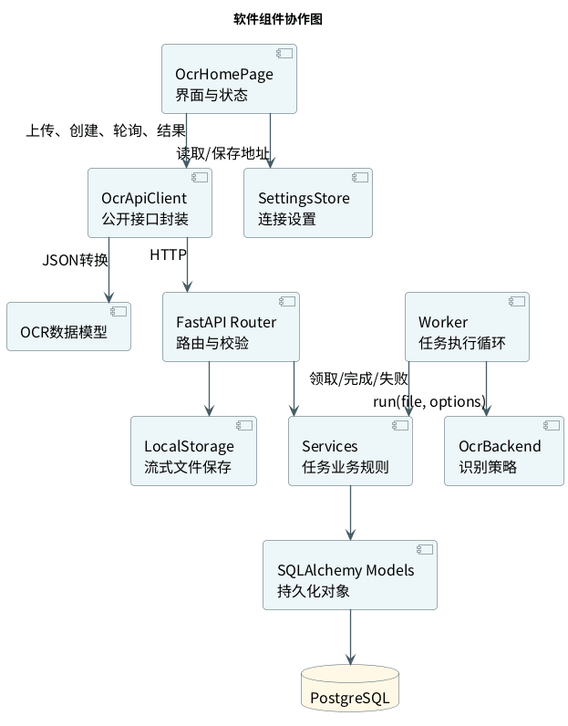

该组件图按照源码文件职责展示移动状态组件、接口客户端、设置存储、数据模型、服务端路由、业务服务、本地存储、持久化模型、工作进程和识别后端的依赖关系。界面不会直接操作数据库或模型，而是经过公开接口；工作进程也不负责HTTP页面展示，而是调用任务服务和统一后端接口。该分层降低移动端、业务规则和具体推理实现之间的耦合。

### 05_mobile_interaction_flow

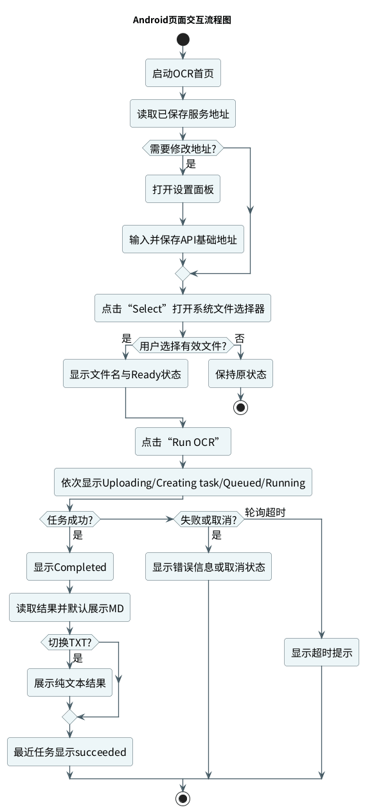

该交互流程图覆盖用户从启动应用到取得识别结果的完整页面路径，包括连接设置、系统文件选择、Ready状态、执行按钮、上传与创建任务、排队与运行、成功、失败、取消、轮询超时以及MD/TXT切换。不同分支与客户端现有状态字段和服务端任务枚举对应，可用于检查页面状态是否遗漏，并为后续补采运行截图提供明确场景清单。

### 06_settings_sequence

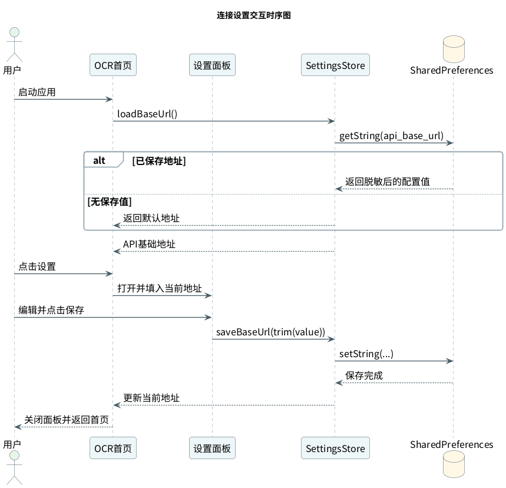

该时序图使用用户、OCR首页、设置面板、SettingsStore和SharedPreferences五条生命线描述连接地址的读取与保存。应用启动时先读取已保存值，缺失时回退默认值；用户编辑后保存前会去除首尾空白，再更新当前页面。该流程只表示服务入口设置，不表示系统已经实现账号认证。材料中的具体网络地址继续按脱敏规则处理。

### 07_file_upload_sequence

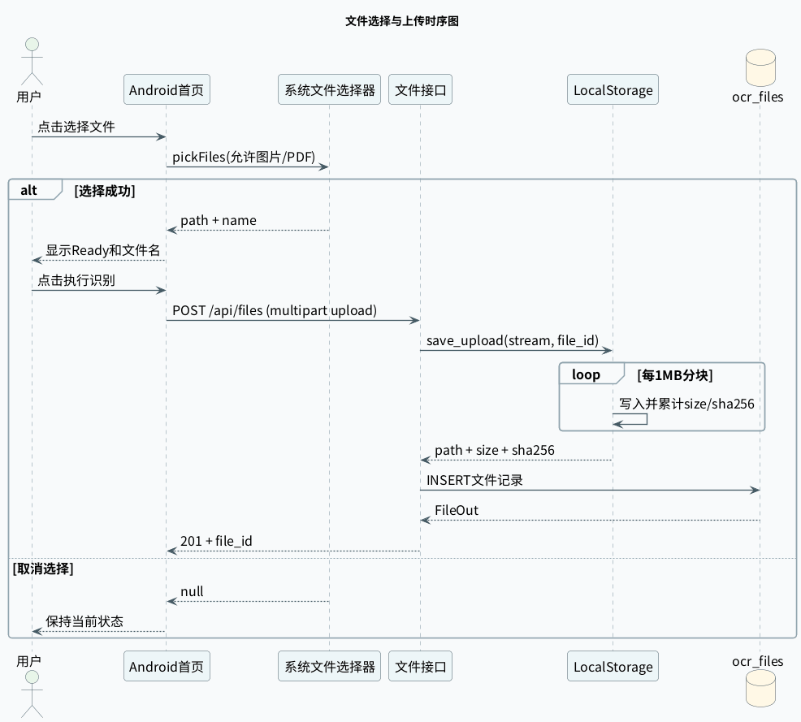

该时序图描述系统文件选择器、Android首页、文件接口、本地存储和文件记录之间的顺序调用。用户选择成功后页面先进入Ready，点击执行后才发起multipart上传；服务端按块保存文件并同步计算大小和SHA-256，最后写入ocr_files并返回file_id。取消选择分支不会创建网络请求，体现了客户端对用户操作和服务端持久化之间的边界。

### 08_task_poll_sequence

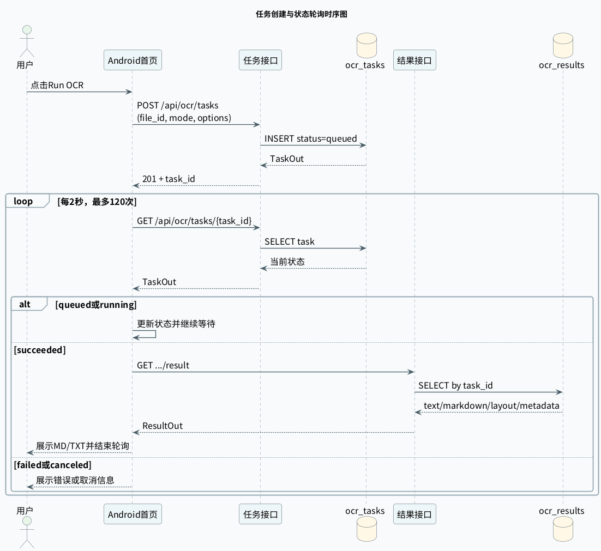

该时序图描述上传成功后的任务创建和状态轮询。客户端提交文件标识、模式与选项，服务端创建queued任务；随后客户端每两秒查询一次，最多一百二十次。排队和运行状态继续等待，成功状态触发结果接口读取，失败或取消状态终止轮询并显示信息。图中用循环和条件分支明确表达了普通关系图无法呈现的时间顺序。

### 09_queue_claim_sequence

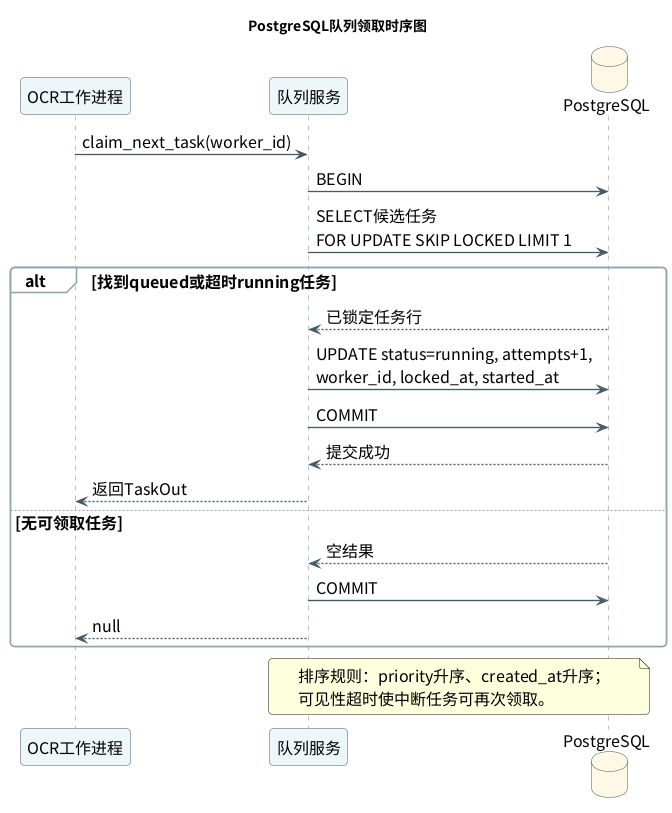

该时序图展示OCR工作进程、队列服务与PostgreSQL之间的事务交互。服务在事务中按优先级和创建时间选择queued或可见性超时的running任务，使用FOR UPDATE SKIP LOCKED避免并发工作进程重复领取同一行，再更新状态、尝试次数、工作进程和锁时间并提交。无候选任务时返回空值，不产生虚假任务。

### 10_inference_sequence

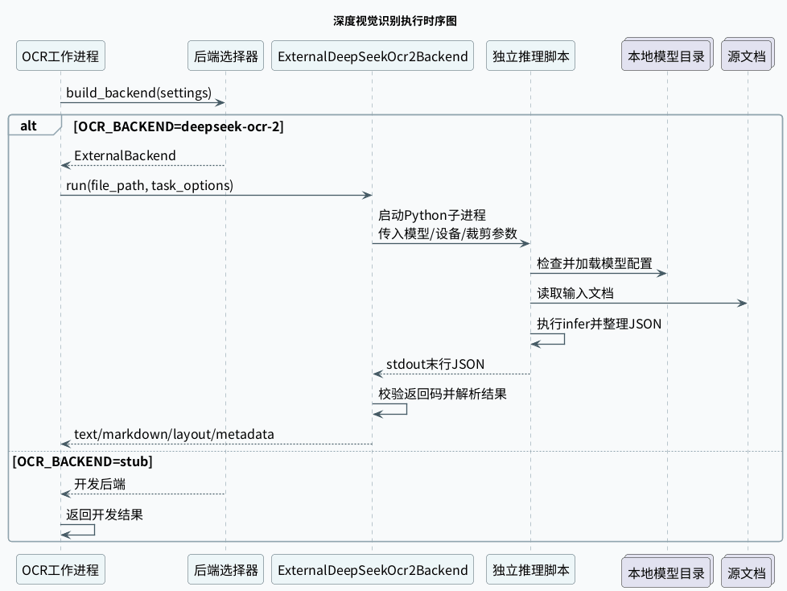

该时序图展示工作进程选择识别后端并执行文档推理的顺序。显式启用DeepSeek-OCR-2时，后端以受控子进程传入模型目录、设备、裁剪与任务选项，推理脚本检查模型和输入文件、执行识别并从标准输出末行返回JSON；开发后端则不加载GPU模型。该图说明代码已具备接入路径，但不把本轮未完成的真实模型精度验证写成既有结论。

### 11_result_sequence

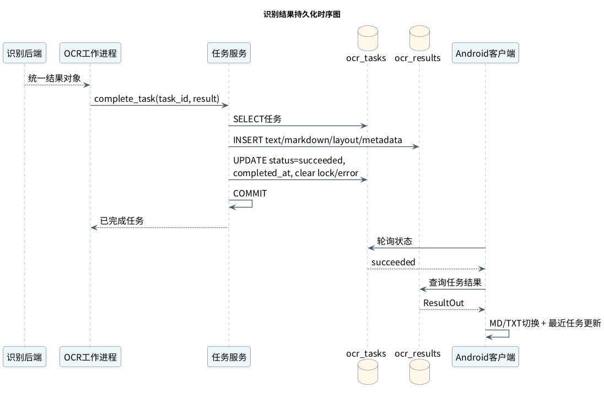

该时序图描述识别结果从后端回到Android客户端的持久化过程。任务服务新增唯一结果记录，保存纯文本、Markdown、版面和元数据，并在同一业务提交中把任务置为succeeded、记录完成时间、清理锁与错误。客户端轮询发现成功后查询结果，并在页面内执行MD/TXT切换及最近任务更新。

### 12_cancel_failure_sequence

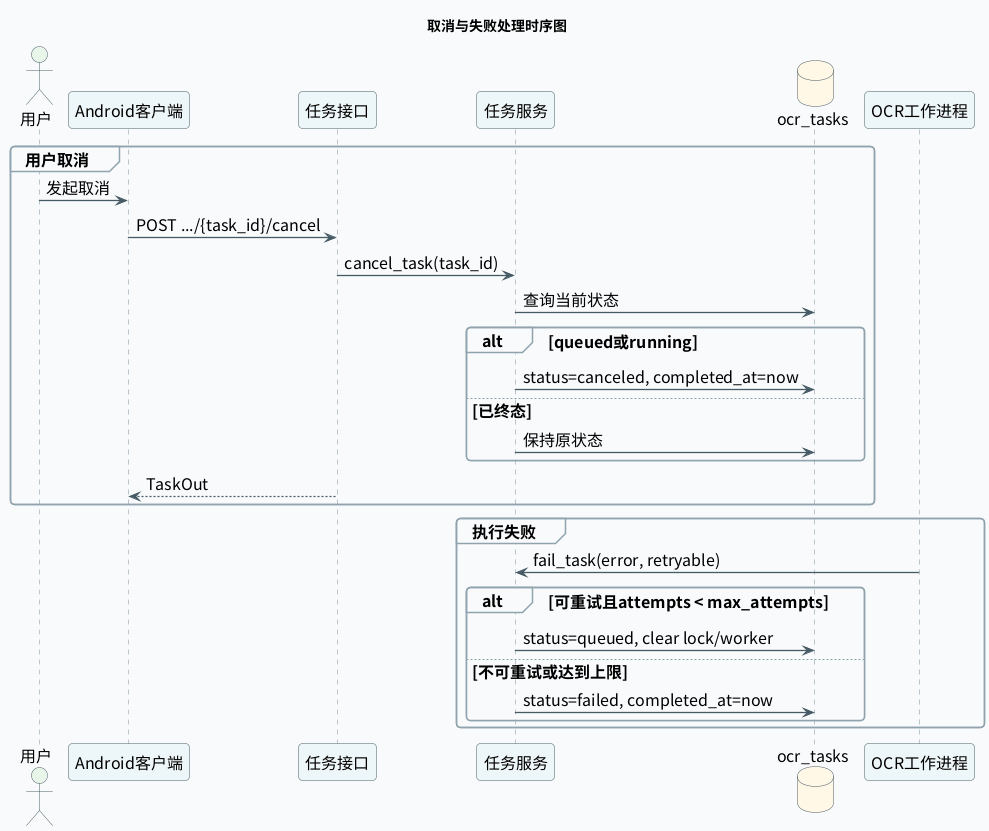

该时序图并列展示用户取消和工作进程失败两条异常路径。取消只对queued或running任务改变状态，终态任务保持不变；执行失败则依据retryable、attempts和max_attempts决定回到queued还是进入failed。两条路径都通过任务服务更新PostgreSQL，避免客户端或工作进程绕过业务规则直接修改数据。

### 13_task_state

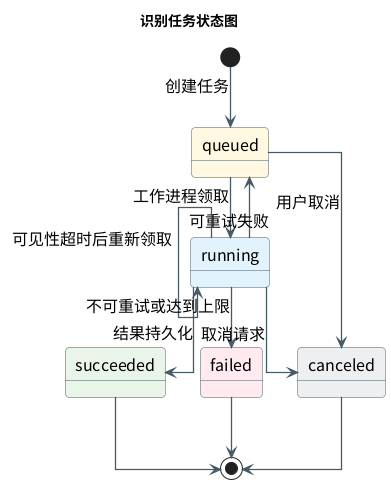

该状态图定义queued、running、succeeded、failed和canceled五种真实任务状态及其转换条件。新任务从queued开始，领取后进入running；结果持久化进入成功，可重试失败回到排队，不可重试或达到上限进入失败，用户取消进入取消。可见性超时允许运行任务再次领取，支撑工作进程异常退出后的恢复。

### 14_er_model

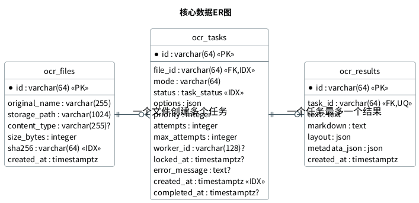

该ER图使用真实表名、字段、主键、外键、唯一约束与索引标记描述数据模型。ocr_files与ocr_tasks是一对多关系，一个上传文件可创建多个识别任务；ocr_tasks与ocr_results是一对零或一关系，结果task_id唯一。图中包含文件摘要、任务状态与重试、锁定时间、文本、Markdown、版面和元数据等业务字段，不以通用审计字段代替业务设计。

### 15_domain_class

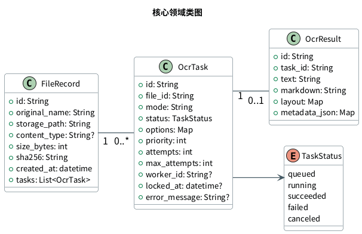

该类图从应用对象角度展示FileRecord、OcrTask、OcrResult和TaskStatus。类中列出真实业务字段、可空字段、集合关系和状态枚举；文件对象关联多个任务，任务最多关联一个结果，并通过TaskStatus限制合法状态。该图与ER图分别解释面向对象关系和数据库约束，避免将二者混为单一表格框图。

### 16_api_boundary

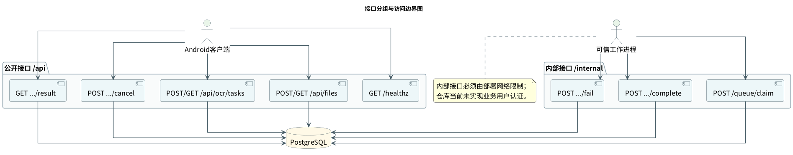

该接口边界图区分Android客户端可调用的健康、文件、任务、取消和结果公开接口，以及可信工作进程使用的领取、完成和失败内部接口。所有接口最终通过业务服务访问PostgreSQL，但移动端不直接接触内部队列路径。由于当前仓库没有认证模块，图中明确把内部路径的生产网络限制列为部署要求，而不是虚构为现有权限功能。

### 17_storage_activity

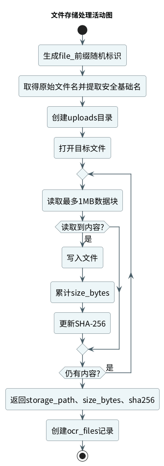

该活动图描述上传文件在服务端的保存算法。系统生成业务标识，提取安全基础文件名，创建上传目录，然后循环读取固定大小的数据块，在写入文件的同时累计字节数并更新SHA-256。读取结束后返回路径、大小和摘要并创建文件记录。该流程说明文件不会整体一次性载入内存，也解释了数据库字段的来源。

### 18_retry_activity

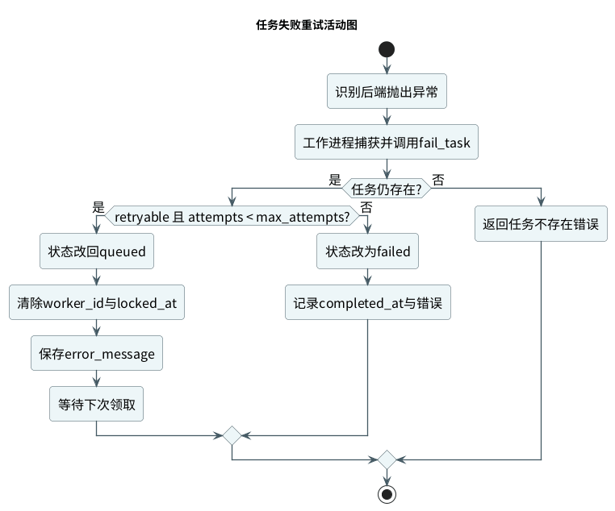

该活动图描述工作进程捕获识别异常后的重试决策。任务存在且故障可重试、尝试次数未达上限时，状态回到queued并清除锁与工作进程标识；否则进入failed并记录完成时间和错误。该流程与队列领取和任务状态图配合，说明异常恢复不是简单重复调用，而受最大尝试次数约束。

### 19_security_boundary

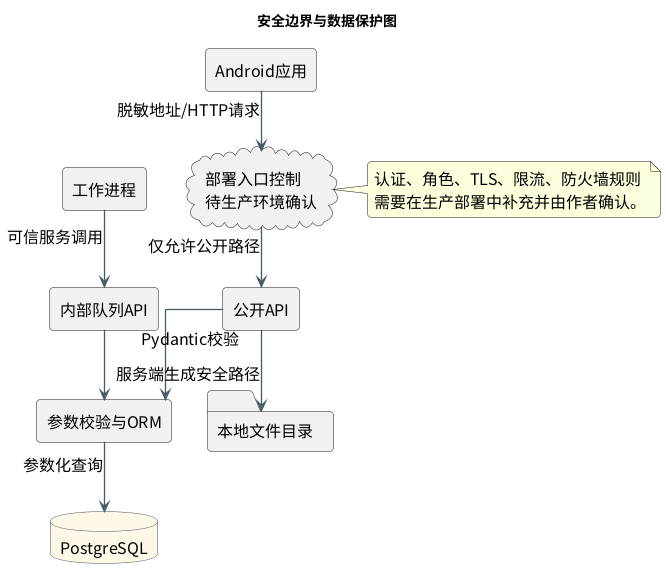

该安全边界图只呈现可从代码和部署配置核验的控制：服务端生成安全文件路径、Pydantic输入校验、ORM参数化查询、公开与内部接口路径分离、敏感地址脱敏。认证、角色、TLS、限流和生产防火墙没有在仓库完整实现，因此被清楚标记为待部署或待作者确认，避免把建议控制写成现有能力。

### 20_test_strategy

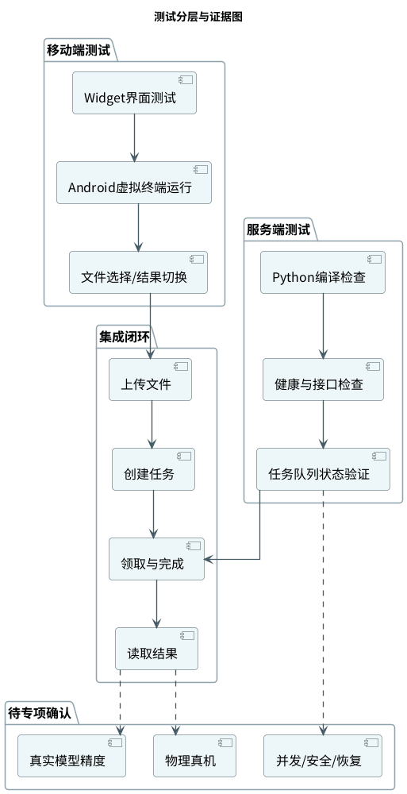

该测试分层图将现有证据划分为移动端组件与虚拟终端运行、服务端编译和接口状态、上传至结果读取的集成闭环，以及仍待专项确认的物理真机、真实模型精度、并发安全和恢复测试。图示可以直接支撑测试章节区分已执行、按条件跳过和待补充事项，防止仅用三张相似界面截图代替完整测试设计。

### 21_e2e_test_sequence

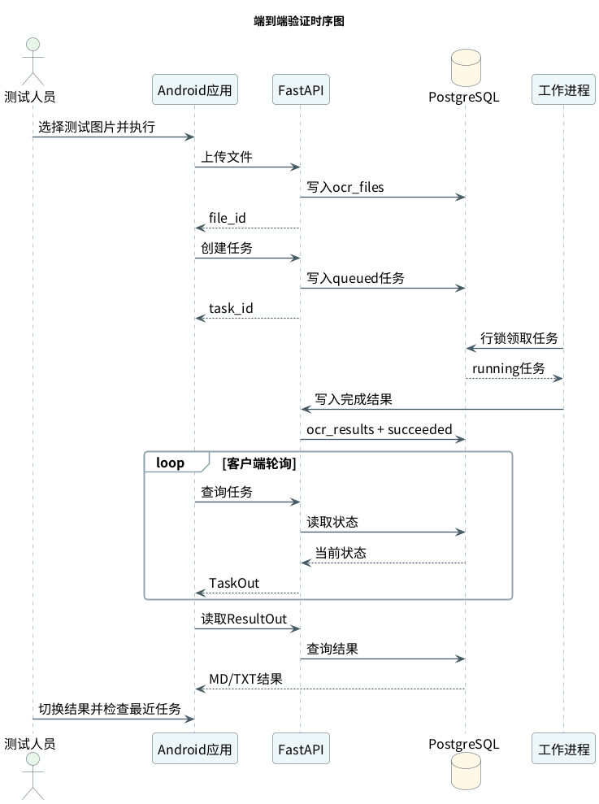

该端到端验证时序图描述测试人员、Android应用、FastAPI、PostgreSQL和工作进程之间的实际验证链路。文件上传写入文件记录，任务创建写入queued状态，工作进程领取并完成，客户端轮询后读取结果并切换展示。该图既是测试步骤的结构化表达，也能对应接口日志、任务数据和运行截图三类证据。

### 22_ui_state_model

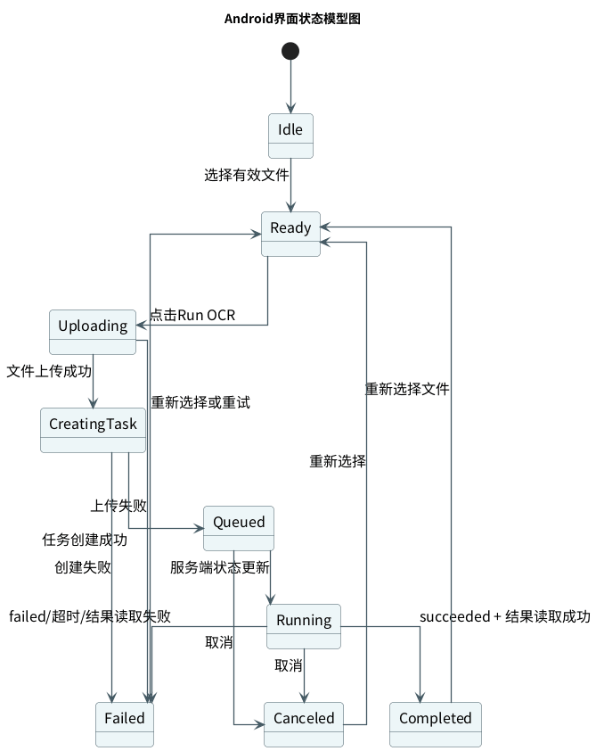

该状态模型图细化Android页面的Idle、Ready、Uploading、CreatingTask、Queued、Running、Completed、Failed和Canceled状态。转换条件来自现有客户端异步流程和服务端任务枚举，可用于验证按钮启用、状态标签、错误信息和重试入口是否一致。它与服务端任务状态图分开，避免混淆界面阶段和数据库状态。

### 23_data_flow

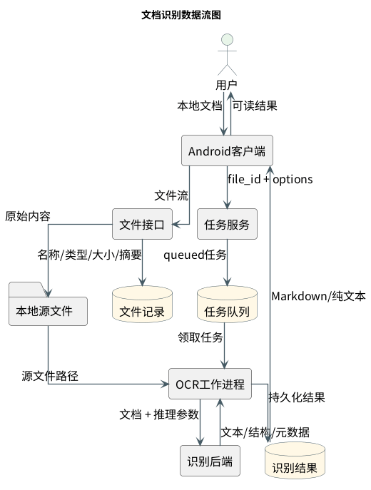

该数据流图从用户文档输入开始，依次展示文件流、文件元数据、任务选项、队列任务、模型输入、识别输出和移动端结果。源文件保存在本地目录，业务记录和结果保存在PostgreSQL，工作进程以文件路径读取源内容并调用识别后端。图中明确不同数据载体，补充架构图不易表达的数据方向。

### 24_error_paths

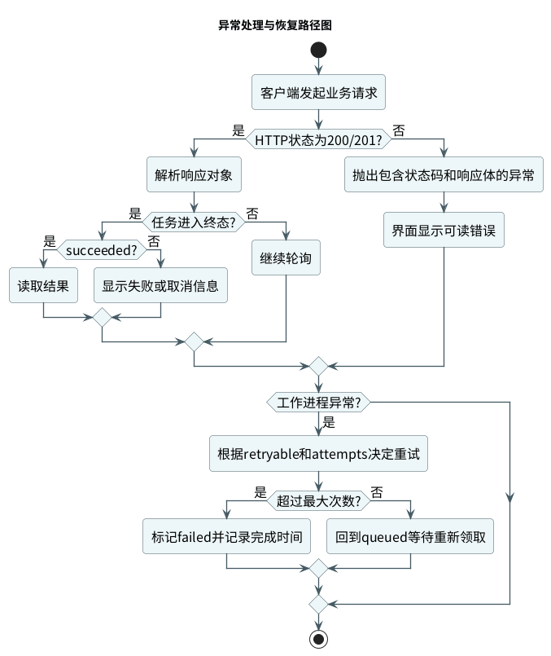

该异常处理图同时覆盖客户端HTTP异常、任务终态处理、轮询继续条件以及工作进程重试决策。非成功HTTP状态会形成包含状态码和响应体的可读错误；服务端执行异常根据是否可重试和最大次数决定重新排队或最终失败。该图用于支撑异常测试用例，并避免说明书只描述理想成功路径。
